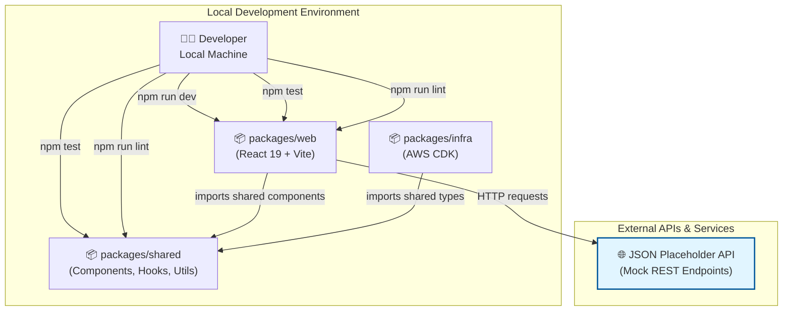

# Local Setup Guide: React Starter

This guide provides the necessary steps to configure, build, and run the React Starter monorepo on your local development machine. The React Starter is a serverless, progressive, and responsive frontend application built with React 19, TypeScript, and a modern development stack.

## Table of Contents

1. [Prerequisites](#1-prerequisites)
2. [Local Architecture Overview](#2-local-architecture-overview)
3. [Environment Configuration](#3-environment-configuration)
4. [Supporting Services](#4-supporting-services)
5. [Installation & Build](#5-installation--build)
6. [After Installation](#6-after-installation)
7. [Running the Application](#7-running-the-application)
8. [Testing Locally](#8-testing-locally)
9. [Troubleshooting](#9-troubleshooting)

## 1. Prerequisites

Before you begin, ensure you have the following tools and access set up on your local machine:

- **Node.js** (v24.x or higher) — Recommended: Install via [nvm (Node Version Manager)](https://github.com/nvm-sh/nvm) so you can use the project's `.nvmrc` file for automatic version management. Alternatively, [download from nodejs.org](https://nodejs.org/).
- **npm** (v10.x or higher) — Installed automatically with Node.js
- **Git** (v2.x or higher) — [Installation Guide](https://git-scm.com/downloads)
- **A code editor** (e.g., Visual Studio Code) — [Download](https://code.visualstudio.com/)

### Using nvm (Recommended)

If you have nvm installed, simply run the following from the project root to automatically switch to the correct Node.js version:

```bash
nvm use
```

This reads the `.nvmrc` file and installs/uses the specified Node.js version.

### Verify Your Installations

To verify your installations, run:

```bash
node --version
npm --version
git --version
```

## 2. Local Architecture Overview

The React Starter is organized as a **TypeScript monorepo** with three integrated packages that work together to deliver a complete frontend application and infrastructure solution:



### Packages Overview

- **`packages/web`**: React 19 frontend application with Vite, featuring authentication, task management, settings, and responsive design
- **`packages/shared`**: Reusable UI components (shadcn/ui-based), custom React hooks, TypeScript types, and Zod validation schemas
- **`packages/infra`**: AWS CDK infrastructure-as-code for provisioning serverless cloud resources (S3, CloudFront, Route53)

The monorepo uses **npm workspaces** for dependency management and provides unified scripts at the root level for building, testing, linting, and formatting all packages.

## 3. Environment Configuration

The React frontend uses environment variables prefixed with `VITE_` for build-time and runtime configuration.

### Setup

1. **Navigate to the web package directory:**

   ```bash
   cd packages/web
   ```

2. **Copy the example environment file:**

   ```bash
   cp .env.example .env
   ```

3. **Update environment variables in `.env`:**

   ```env
   # Required: Base URL for API requests
   VITE_BASE_URL_API=https://jsonplaceholder.typicode.com

   # Optional: Toast notification auto-dismiss duration (milliseconds)
   VITE_TOAST_AUTO_DISMISS_MILLIS=5000

   # Build metadata (typically set by CI/CD, but can be set locally)
   VITE_BUILD_ENV_CODE=local
   ```

   For local development, the minimal configuration requires only `VITE_BASE_URL_API`. The starter uses the free [JSON Placeholder API](https://jsonplaceholder.typicode.com/) for mock data.

4. **Return to the root directory:**

   ```bash
   cd ../..
   ```

For a complete list of available environment variables and their descriptions, see the [Configuration Guide](CONFIGURATION_GUIDE.md).

## 4. Supporting Services

The React Starter does **not require any local supporting services** (databases, caches, containers) to run in development mode.

### API Integration

The application integrates with the **JSON Placeholder API** — a free, public mock REST API that provides simulated user and task data. No local setup or credentials are required; the API is accessed directly from the browser.

**Note on Data Persistence:** JSON Placeholder is stateless. Mutations (create, update, delete) will appear to succeed and update the local TanStack Query cache, but changes are not persisted by the API itself. On refresh, data reverts to the original state. This is intentional for a starter kit and allows you to focus on frontend logic without backend dependencies.

## 5. Installation & Build

Install all dependencies for the monorepo and build the shared package:

1. **Install dependencies:**

   ```bash
   npm install
   ```

   This installs dependencies for all packages in the monorepo (`packages/web`, `packages/shared`, `packages/infra`) and hoists common dependencies to the root `node_modules` directory.

2. **Verify the installation:**

   ```bash
   npm list @react-starter/shared
   npm list @react-starter/web
   ```

   You should see both local packages listed without errors.

3. **Build the shared package (optional for development):**

   ```bash
   npm run build -w packages/shared
   ```

   The shared package is automatically built during the web development server startup if needed.

## 6. After Installation

The installation is now complete! Open the project in your preferred code editor. We recommend [Visual Studio Code](https://code.visualstudio.com/).

### Recommended VS Code Extensions

We recommend installing the following VS Code extensions for an optimal development experience:

#### Required Extensions

- **[Prettier - Code formatter](https://marketplace.visualstudio.com/items?itemName=esbenp.prettier-vscode)** — Ensures that all project participants' contributions are formatted using the same rules. The extension leverages project-specific rules found in the `.prettierrc` file in the project base directory.
- **[Tailwind CSS IntelliSense](https://marketplace.visualstudio.com/items?itemName=bradlc.vscode-tailwindcss)** — A must-have companion for all projects using Tailwind. The extension ensures that Tailwind CSS classes are named and ordered correctly and flags any conflicting classes.

#### Recommended Extensions

- **[GitHub Copilot](https://marketplace.visualstudio.com/items?itemName=GitHub.copilot)** — AI-powered code completion and assistance
- **[ESLint](https://marketplace.visualstudio.com/items?itemName=dbaeumer.vscode-eslint)** — Real-time linting and code quality feedback

#### Optional Extensions

- **[Indent Rainbow](https://marketplace.visualstudio.com/items?itemName=oderwat.indent-rainbow)** — Visual indentation guides
- **[GitLens](https://marketplace.visualstudio.com/items?itemName=eamodio.gitlens)** — Enhanced Git integration and history
- **[Dotenv Official +Vault](https://marketplace.visualstudio.com/items?itemName=dotenv.dotenv)** — Syntax highlighting for `.env` files
- **[GitHub Actions](https://marketplace.visualstudio.com/items?itemName=GitHub.vscode-github-actions)** — GitHub Actions workflow integration

## 7. Running the Application

Start the React Starter in development mode with hot-reload enabled:

### Start the Development Server

From the root directory, run:

```bash
npm run dev -w packages/web
```

Alternatively, navigate to the web package and run:

```bash
cd packages/web
npm run dev
cd ../..
```

The dev server will automatically open your default browser and display the application at `http://localhost:5173`.

### Verifying the Setup

Once the application is running, you should see:

1. The React Starter landing page with navigation and feature descriptions
2. The ability to navigate to different pages (Tasks, Settings, About)
3. A login form on the Auth page (use any username from [JSON Placeholder Users](https://jsonplaceholder.typicode.com/users) with any password)
4. No console errors related to API requests

**Hot Reload in Action:** Modify any source file in `packages/web/src/` or `packages/shared/src/` and save. The browser should automatically refresh to show your changes without a full page reload.

## 8. Testing Locally

The project uses **Vitest** as the unified test runner and **React Testing Library** for component testing.

### Run All Tests (Monorepo-wide)

From the root directory:

```bash
npm test
```

This runs tests across all packages (`packages/web`, `packages/shared`, `packages/infra`).

### Run Tests for a Specific Package

```bash
# Test the web package
npm run test -w packages/web

# Test the shared package
npm run test -w packages/shared

# Test the infra package
npm run test -w packages/infra
```

### Run Tests with Coverage

Generate coverage reports for all packages:

```bash
npm run test:coverage
```

View coverage for a specific package:

```bash
npm run test:coverage -w packages/web
```

Coverage reports are generated in `packages/[package-name]/coverage/` with an `index.html` file for visual inspection.

### Lint and Format Code

Check code quality and formatting:

```bash
# Run ESLint to check for code quality issues
npm run lint

# Automatically fix linting issues
npm run lint:fix

# Check code formatting compliance
npm run format:check

# Automatically format code
npm run format
```

### Pre-commit Hooks

The project uses **Husky** to enforce linting and formatting on `git commit`. If your commit is rejected due to lint or formatting errors, run:

```bash
npm run lint:fix
npm run format
git add .
git commit -m "your message"
```

## 9. Troubleshooting

| Symptom / Error Message                                                            | Likely Cause                                               | Resolution                                                                                                                                                            |
| ---------------------------------------------------------------------------------- | ---------------------------------------------------------- | --------------------------------------------------------------------------------------------------------------------------------------------------------------------- |
| `ERR! ERR! 404 Not Found - GET https://registry.npmjs.org/@react-starter%2Fshared` | npm registry cache issue or workspace symlinks not created | Run `npm install` from the root directory to ensure workspace symlinks are properly established.                                                                      |
| `ENOENT: no such file or directory, open '.../packages/web/.env'`                  | `.env` file is missing from the web package                | Navigate to `packages/web` and run `cp .env.example .env`. Update `VITE_BASE_URL_API` if needed.                                                                      |
| `Error: Cannot find module '@react-starter/shared'`                                | Shared package not installed or workspace symlinks missing | Run `npm install` from the root directory.                                                                                                                            |
| `Vite failed to load config file...` or blank browser screen                       | Vite config issue or environment not set                   | Ensure `.env` file exists in `packages/web`. Check browser console for errors. Clear browser cache and restart the dev server.                                        |
| `Tests fail with "Cannot find module" errors`                                      | Node.js resolution issue or missing vitest setup           | Run `npm install` from the root to ensure all dependencies are installed.                                                                                             |
| Port 5173 already in use                                                           | Another application is using the Vite default port         | Run the dev server on a different port: `npm run dev -- --port 5174`                                                                                                  |
| API requests to JSON Placeholder fail (CORS errors)                                | Network connectivity or JSON Placeholder service down      | Check your internet connection. Verify [JSON Placeholder](https://jsonplaceholder.typicode.com/) is accessible. Some corporate firewalls may block external requests. |

### Additional Resources

If you encounter an issue not listed here:

1. Check the [Project Overview](OVERVIEW.md) for architectural details
2. Review the [Configuration Guide](CONFIGURATION_GUIDE.md) for environment setup
3. Consult the main [README](../README.md) for project information
4. Check the browser console and terminal output for specific error messages
5. Ensure all prerequisites are installed with correct versions (`node --version`, `npm --version`)

<br/>

---

:point_left: Return to [Documentation](./README.md).
