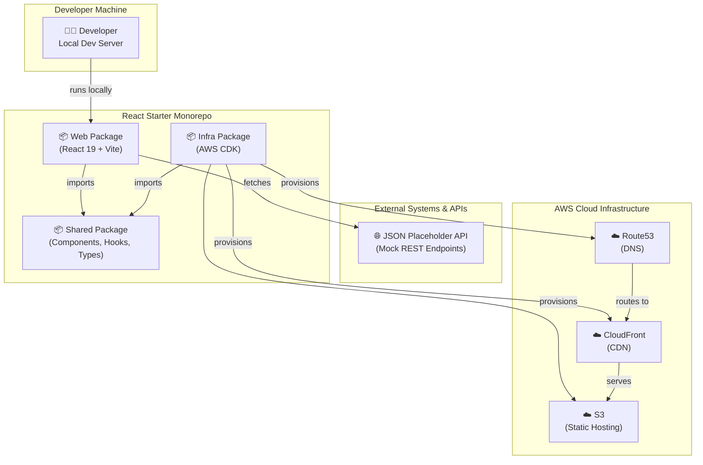
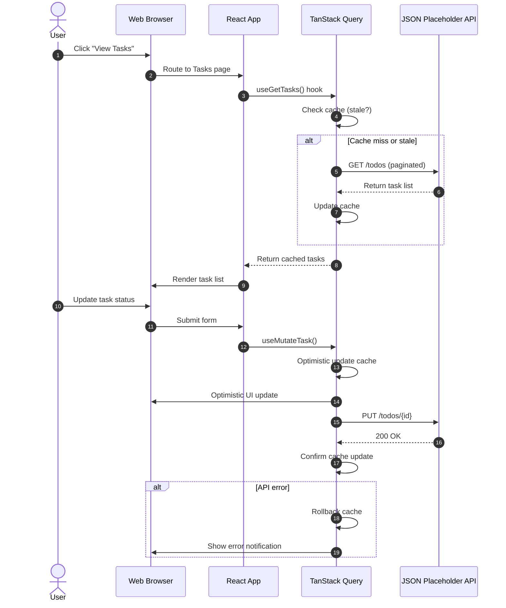

# Project Overview: React Starter

A **serverless, progressive, responsive starter user interface (UI)** built with React 19, TypeScript, and a modern development stack. This monorepo provides a complete, production-ready foundation for building scalable web applications with integrated cloud infrastructure using AWS CDK.

## Introduction

The **React Starter** is a comprehensive frontend application framework paired with infrastructure-as-code tooling for rapid development and deployment. At its core is a React 19 single-page application (SPA) powered by Vite, featuring a modular component architecture with TypeScript strict mode, comprehensive testing with Vitest and React Testing Library, and a curated selection of modern libraries including TanStack Query, Tailwind CSS, shadcn/ui, and React Hook Form.

The project is structured as a monorepo with three integrated workspaces:

- **`packages/web`**: A React 19 frontend application with serverless architecture and progressive enhancement
- **`packages/shared`**: Reusable UI components, hooks, types, and validation schemas consumed by the frontend
- **`packages/infra`**: AWS CDK infrastructure code for provisioning serverless cloud resources (CDN, hosting, DNS)

## Business Value and Purpose

The React Starter addresses the challenge of establishing a consistent, maintainable frontend architecture across multiple projects. Rather than reinventing foundational patterns for routing, state management, form handling, styling, and testing for each new application, this project provides:

- **Accelerated Time-to-Market**: Teams can bootstrap new web applications in minutes with a battle-tested architecture, eliminating repetitive setup and decision-making overhead.
- **Consistent Quality Standards**: Built-in code quality practices (linting, formatting, testing) ensure all applications maintain high standards without additional configuration burden.
- **Shared Component Library**: A curated collection of composable UI components with accessibility baked in, reducing duplication and ensuring visual consistency.
- **Production Readiness**: Integrated with AWS CDK for seamless infrastructure provisioning, automated deployment pipelines, and serverless scalability without manual DevOps configuration.
- **Knowledge Transfer**: Serves as a reference implementation and learning resource for engineering teams adopting modern React patterns, TypeScript best practices, and monorepo architecture.

## System Context

The React Starter is structured as a **TypeScript monorepo** with three integrated packages working together to deliver a complete frontend application and infrastructure solution:

**Frontend Package (`packages/web`):** A React 19 single-page application built with Vite, featuring authenticated user sessions, task management functionality, settings management, and responsive design. It consumes shared UI components and utilities from the shared package.

**Shared Package (`packages/shared`):** A library package exporting reusable React components (built on shadcn/ui), custom hooks, TypeScript types, Zod validation schemas, and utility functions. This package is consumed as an npm dependency by the web frontend and infra packages.

**Infrastructure Package (`packages/infra`):** AWS CDK infrastructure-as-code for provisioning serverless cloud resources. It defines stacks for CloudFront CDN distribution, S3 static hosting, Route53 DNS management, and configuration validation.

**External Dependencies:**

- **JSON Placeholder API**: A mock REST API providing simulated user and task data for development and demonstration
- **AWS Services**: S3 (static hosting), CloudFront (CDN), Route53 (DNS), CloudFormation (infrastructure orchestration)
- **Third-party NPM Libraries**: React, TanStack Query, Tailwind CSS, shadcn/ui, React Hook Form, Zod, and others

**System Context Diagram**

## Architecture and Internal Workflow

The **React Starter** employs a layered component architecture with clear separation of concerns:

**Routing & Code Splitting:** React Router DOM v7 provides declarative, nested routing with lazy-loaded code splitting via `Suspense` boundaries. Each page (Landing, Auth, Tasks, Settings, About) is loaded on-demand to minimize initial bundle size.

**State Management:** A hybrid approach combines:

- **Context API + Custom Hooks** for global state (authentication, theme, notifications)
- **TanStack Query** for server state management (data fetching, caching, synchronization with JSON Placeholder API)
- **React Hook Form + Zod** for local form state and runtime validation

**Component Architecture:** A three-tier component hierarchy:

1. **Atomic Components** (Shared Package): shadcn/ui-based primitives (Button, Input, Dialog, Card, etc.)
2. **Composed Components** (Shared Package): Domain-specific components built from atomic components (Alert, Loader, Chart, Content, etc.)
3. **Page Components** (Web Package): Page-level containers composed from shared components and feature-specific logic

**UI & Styling:** Tailwind CSS provides utility-first styling with CSS custom properties enabling dynamic theming and light/dark mode support. CVA (Class Variance Authority) manages component style variants while maintaining type safety.

**Data Flow:** User interactions trigger events that update component state or trigger API calls through custom hooks (e.g., `useGetCurrentUser`). TanStack Query handles server state, caching, and background synchronization. Optimistic updates simulate responsiveness while maintaining data consistency through automatic rollback on errors.

**Primary Workflow Diagram: User Task Management**

## Key Features and Capabilities

### Frontend Architecture & Development

- **React 19 + TypeScript Strict Mode:** Type-safe development with strict null checking and exhaustive type inference
- **Vite Build Tool:** Lightning-fast development server with hot module replacement (HMR) and optimized production builds
- **Modular Component Architecture:** Clear separation between shared components, hooks, utilities, and page-specific features with co-located tests
- **Lazy-loaded Code Splitting:** Route-based lazy loading with `Suspense` boundaries for minimal initial bundle and optimized streaming
- **Responsive Design:** Mobile-first Tailwind CSS with semantic HTML and WAI-ARIA guidelines for accessibility

### Component Library & UI

- **shadcn/ui Components:** Pre-built, accessible component primitives (Button, Dialog, Dropdown, Tabs, Card, Badge, etc.) with full Tailwind customization
- **Icon System:** Integrated Font Awesome and Lucide icons for consistent iconography
- **Theming & Styling:** CSS custom properties for dynamic theme switching (light/dark mode), CVA for type-safe component variants
- **Composition Patterns:** Reusable, composable components following single responsibility principle

### State & Data Management

- **TanStack Query (React Query):** Server state management with automatic caching, background synchronization, and request deduplication
- **Context API + Custom Hooks:** Global state for authentication, theme, notifications, and configuration
- **React Hook Form:** Performant form handling with minimal re-renders and flexible field composition
- **Zod Validation:** Compile-time and runtime type-safe validation schemas for forms, configurations, and API payloads

### API Integration

- **Axios HTTP Client:** Centralized HTTP configuration with request/response interceptors and error handling
- **JSON Placeholder Integration:** Mock REST API for demonstration and development without backend dependencies
- **Custom API Hooks:** Encapsulated data-fetching logic (e.g., `useGetCurrentUser`, `useGetTasks`) with loading, error, and success states
- **Optimistic Updates:** User interface immediately reflects mutations with automatic rollback on errors for responsive UX

### Testing & Quality Assurance

- **Vitest Framework:** Fast, Vite-native unit test runner with ESM-first architecture
- **React Testing Library:** Component testing focused on user interactions and DOM behavior, not implementation details
- **Co-located Tests:** Unit tests (`*.test.ts(x)`) sit directly next to source files for discoverability and maintainability
- **Code Coverage:** Comprehensive test coverage tracking with 70%+ minimum requirement across all workspaces
- **ESLint & Prettier:** Automated linting and code formatting enforced via pre-commit hooks

### Infrastructure & Deployment

- **AWS CDK:** Infrastructure-as-code provisioning for S3, CloudFront, Route53, and CloudFormation orchestration
- **Serverless Architecture:** Scalable, stateless frontend deployment without server management overhead
- **Automated CI/CD:** GitHub Actions workflows for testing, linting, and building on every push
- **Environment Configuration:** Type-safe configuration management with Zod validation and environment-specific `.env` files

## Interfaces and Events

### Application Entry Points

**Web Application (`packages/web/src/main.tsx`):** The React Starter is a client-side single-page application (SPA) with no server-side APIs. Users access the application through a browser at the deployment domain (e.g., `https://react-starter.leanstacks.net`).

**Routing & Page Routes:**

- `/` – Landing page with project information and authentication options
- `/auth` – Authentication/login page (accepts any username + password for demo)
- `/settings` – User settings and preference management
- `/tasks` – Task list management interface (CRUD operations on mock tasks)
- `/about` – About page with project details

### External API Integration

The application integrates with **JSON Placeholder** (https://jsonplaceholder.typicode.com/), a free mock REST API:

- `GET /users` – Fetch list of available users for authentication
- `GET /users/{id}` – Fetch current user profile
- `GET /todos` – Fetch task list (paginated)
- `POST /todos` – Create new task (creates without persistence)
- `PUT /todos/{id}` – Update task status (updates without persistence)
- `DELETE /todos/{id}` – Delete task (deletes without persistence)

**Note:** JSON Placeholder is stateless. Create, update, and delete operations return success but don't persist. The application manages local cache through TanStack Query to simulate state.

### No Event-Driven Architecture

This is a **frontend-only application** with no server-side event system. All state transitions occur via:

- **User Interactions:** DOM events (click, submit, input) triggering React state updates
- **HTTP Requests:** Synchronous REST API calls to JSON Placeholder via Axios and TanStack Query
- **Internal Notifications:** Toast notifications via Context API for user feedback

## Dependencies

### Runtime Dependencies (Production)

| Package                    | Purpose                             | Version |
| -------------------------- | ----------------------------------- | ------- |
| `react`                    | UI component library                | 19.2.8+ |
| `react-dom`                | React DOM rendering                 | 19.2.8+ |
| `react-router-dom`         | Declarative routing and navigation  | 7.18.2+ |
| `@tanstack/react-query`    | Server state management and caching | Latest  |
| `axios`                    | HTTP client for API requests        | Latest  |
| `react-hook-form`          | Performant form state management    | Latest  |
| `zod`                      | TypeScript-first schema validation  | 4.4.3+  |
| `tailwindcss`              | Utility-first CSS framework         | Latest  |
| `shadcn/ui`                | Accessible component library        | Latest  |
| `class-variance-authority` | Type-safe component variants        | 0.7.1+  |
| `lucide-react`             | Icon component library              | Latest  |
| `react-i18next`            | Internationalization framework      | Latest  |
| `@tanstack/react-table`    | Headless table component            | Latest  |
| `recharts`                 | Composable charting library         | Latest  |

### Development Dependencies (Build & Test)

| Package                       | Purpose                                  |
| ----------------------------- | ---------------------------------------- |
| `typescript`                  | Static type checking                     |
| `vite`                        | Lightning-fast build tool and dev server |
| `vitest`                      | Unit test framework (Vite-native)        |
| `@testing-library/react`      | React component testing utilities        |
| `@testing-library/user-event` | User interaction simulation              |
| `eslint`                      | Code linting and quality analysis        |
| `prettier`                    | Code formatting                          |
| `husky`                       | Git hooks for pre-commit quality checks  |

### Infrastructure Dependencies (AWS CDK)

| Package       | Purpose                    |
| ------------- | -------------------------- |
| `aws-cdk-lib` | AWS CDK framework          |
| `constructs`  | CDK component base library |

### System Requirements

- **Node.js:** 20.x or higher (LTS recommended)
- **npm:** 10.x or higher
- **Git:** 2.40 or higher
- **TypeScript:** 5.x (installed as dev dependency)
- **Operating System:** macOS, Linux, or Windows (WSL2)

## Onboarding and Getting Started

New developers should follow these steps to set up a development environment and begin contributing:

1. **Understand the Project Structure**
   - Read the [Project Overview](./OVERVIEW.md) (this document) for architectural context
   - Review the [Documentation Index](./README.md) for links to detailed guides

2. **Set Up Local Environment**
   - Follow [Local Setup Guide](./LOCAL_SETUP.md) for installation, dependency setup, and running the application locally

3. **Explore the Codebase**
   - Review the [AGENTS.md](../AGENTS.md) file for monorepo standards, naming conventions, and coding principles
   - Explore the `packages/web/src` directory to understand the page-based feature organization
   - Browse `packages/shared/src/components` to discover available UI components

4. **Configure Your Application**
   - Read the [Configuration Guide](./CONFIGURATION_GUIDE.md) for environment variables, feature flags, and runtime settings

5. **Understand Infrastructure**
   - Review the [Infrastructure Guide](./INFRASTRUCTURE_GUIDE.md) to learn about AWS CDK stacks and deployment

6. **Learn About UI Components**
   - Consult the [shadcn Components Guide](./SHADCN_GUIDE.md) for adding and customizing UI components

7. **Run Tests Locally**
   - Execute `npm test --workspaces` to run all unit tests across the monorepo
   - Run `npm run test:coverage --workspaces` to check code coverage

8. **Verify Code Quality**
   - Execute `npm run lint` to check for linting issues
   - Execute `npm run format` to auto-format code with Prettier

### Helpful Links

- **Live Demo:** https://react-starter.leanstacks.net/
- **GitHub Repository:** https://github.com/leanstacks/react-starter
- **JSON Placeholder API:** https://jsonplaceholder.typicode.com/ (mock data source used in development)
- **React Documentation:** https://react.dev/
- **shadcn Documentation:** https://ui.shadcn.com/docs
- **Tailwind CSS Documentation:** https://tailwindcss.com/
- **TanStack Query Documentation:** https://tanstack.com/query/latest/
- **AWS CDK Documentation:** https://docs.aws.amazon.com/cdk/

 

---

:point_left: Return to [Documentation](./README.md).
